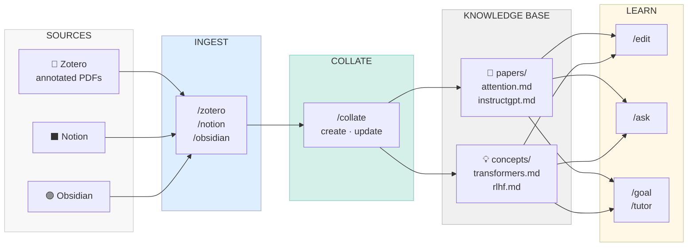

# UReKA: A Personal Research Knowledge Agent for Researchers

*Built during [Agents4Academia](https://github.com/Agents4Academia-AI), 15–26 June 2026.*

---

## The Problem

Every researcher knows the feeling: you've read 50 papers on a topic. You highlighted the key equations in Zotero. You wrote margin notes. You made a Notion page summarising your intuitions. Six months later you start a new project that touches the same area - and you can't find anything. The highlights are buried three folders deep. The Notion page doesn't link to the papers. None of it connects.

The knowledge is *there*, technically. But it's not usable.

The problem isn't storage. Researchers today have excellent tools for storing sources: Zotero, Notion, Obsidian, etc. The problem is **synthesis** and **retrieval** - converting a pile of annotated PDFs and scattered notes into something you can *think with*. That gap is where most research knowledge goes to die.

There's a second, related problem: **structured self-study**. When you want to enter a new subfield — say, diffusion models — the information landscape is overwhelming. Papers assume different backgrounds. Tutorials skip the maths. There's no obvious progression from "I know nothing" to "I can read a modern paper critically and implement something."

---

## Prior Work and Its Limits

Several tools have tried to address pieces of this:

**Zotero + plugins.** The gold standard for paper management. Its PDF reader supports highlights, notes, and tags. But annotations are per-paper: there's no way to ask "what did I think about the ELBO across all the papers I've read?" The Zotero database is a filing cabinet, not a knowledge graph.

**Notion / Obsidian.** Tools for building personal wikis and linked notes — Obsidian with `[[wikilinks]]`, Notion with relational page linking. Great for personal synthesis if you put the work in — but the work is *entirely manual*. You write the summary yourself, you draw the connections yourself, you maintain the structure yourself. With a large literature base, this becomes a second job.

**Generic RAG (retrieval-augmented generation) systems.** Off-the-shelf RAG pipelines — chunk PDFs, embed with an encoder, retrieve by cosine similarity, send to an LLM — are available from LangChain, LlamaIndex, and others. These work for *querying* documents you haven't read. But they have no concept of *personal* knowledge: they don't know which parts you annotated, which questions you flagged, which ideas you connected to other ideas. The retrieved context is the paper's text, not your understanding of it.

**LLM paper summarisers (Paper Digest, Semantic Scholar AI, etc.).** These generate summaries of individual papers, sometimes with highlights. But they're stateless: no personal context, no cross-paper synthesis, no memory of what you've already read and what questions remain open.

**Anki / spaced repetition.** Good for memorising things. Not designed to help you build the conceptual understanding needed to *read critically* or *apply ideas* to a new problem.

The common thread: existing tools address storage, or summarisation, or recall in isolation. None of them treat the problem as a **knowledge engineering** challenge — taking raw annotated sources and turning them into a structured, queryable, interlinked base that reflects how *you* understand the field.

---

## UReKA: What We Built

**UReKA** is yo**u**r personal **re**search **k**nowledge management **a**gent that lives inside
[Claude Code](https://claude.ai/code). It ingests annotated research sources, synthesises them into structured knowledge pages, and lets you query, co-edit, and build on them — all from your editor, with no new UI to learn.

The architecture has five layers.



*Sources flow in → ingested & personalised → synthesised into a connected knowledge base → queryable and learnable.*

### 🔵 Layer 1: Ingest

Material comes in from wherever you keep it:

- <code style="background:#ddeeff;border:1px solid #88aacc;padding:1px 6px;border-radius:4px">/zotero</code> — pulls a PDF from your local Zotero library, extracts body text page by page, and lifts your ink annotations (handwritten strokes → PNG crops). Produces a structured `sources/zotero_*.md` and a `notes/zotero_*/annotations.md` alongside it.
- <code style="background:#ddeeff;border:1px solid #88aacc;padding:1px 6px;border-radius:4px">/notion</code> — fetches a Notion page live via the Notion MCP, or reads a local `.md`/`.html` export.
- <code style="background:#ddeeff;border:1px solid #88aacc;padding:1px 6px;border-radius:4px">/obsidian</code> — ingests any local `.md` file (Obsidian note, exported doc, anything).
- <code style="background:#ddeeff;border:1px solid #88aacc;padding:1px 6px;border-radius:4px">/alphaxiv</code> — fetches an arXiv paper's metadata, abstract, and AI overview by arXiv ID via the AlphaXiv API, producing a structured source file without you downloading a PDF.
- <code style="background:#ddeeff;border:1px solid #88aacc;padding:1px 6px;border-radius:4px">/web</code> — pulls a web resource (Wikipedia article, blog post, tutorial, docs page) through a credibility-scoring engine. Each web source carries a tier and score in its frontmatter so you can audit where any fact came from.

Everything lands in `sources/` (objective text) or `notes/` (personal annotations, highlights, summaries).

### 🟢 Layer 2: Synthesise

<code style="background:#d4f0e8;border:1px solid #66aa88;padding:1px 6px;border-radius:4px">/collate &lt;topic&gt;</code> takes everything you've ingested on a topic and synthesises it into a single structured page — auto-detecting whether this is a **paper page** (`papers/<slug>.md`) or a **concept page** (`concepts/<slug>.md`).

Paper pages weave together the objective summary with your personal annotations and questions as callouts. Concept pages synthesise across multiple sources, include the key mathematics where relevant, and cross-link to related papers and concepts via wikilinks. Every claim cites the `sources/` or `notes/` file it came from — so the result is grounded, auditable, and honest about gaps.

<code style="background:#d4f0e8;border:1px solid #66aa88;padding:1px 6px;border-radius:4px">/edit &lt;page&gt;</code> lets you co-edit any page in place: you can leave `@claude: expand this` comments inline, give chat instructions, or build on your own edits — always grounded in the page's cited sources.

### 🟡 Layer 3: Query

<code style="background:#fff8e6;border:1px solid #ccaa44;padding:1px 6px;border-radius:4px">/ask &lt;question&gt;</code> retrieves the relevant notes from across the base, synthesises a cited answer, and explicitly flags gaps — things the question touches that aren't in the knowledge base yet. The underlying retrieval (BM25 + wikilink expansion, pure Python, no LLM) can also be called directly via <code style="background:#fff8e6;border:1px solid #ccaa44;padding:1px 6px;border-radius:4px">/retrieve &lt;topic&gt;</code> to list relevant notes without synthesising — useful when you just want to see what you have.

The index auto-rebuilds in the background after edits settle, so it's always current without blocking your work.

### 🟡 Layer 4: Learning Courses

A three-stage pipeline for structured self-study.

<code style="background:#fff8e6;border:1px solid #ccaa44;padding:1px 6px;border-radius:4px">/goal &lt;topic&gt;</code> (optionally with a deadline and weekly hours, e.g. `/goal "diffusion models" 1 month 5 h/week`) defines your learning target and scope, audits your existing knowledge base against it (classifying what's covered, what's missing, what needs revisiting), and writes a `course/<slug>/goal.md`. Then it automatically hands off to `/curriculum`.

<code style="background:#fff8e6;border:1px solid #ccaa44;padding:1px 6px;border-radius:4px">/curriculum &lt;slug&gt;</code> builds a full course on that goal. It runs `/autoexplore` (see Layer 5 below) to construct a concept web of vetted resources (papers read full-text, Wikipedia articles, blog posts, tutorials) decomposed into interlinked `papers/` and `concepts/` pages in a per-course library. It sequences these into modules (foundational → core → advanced), builds a weekly schedule against your hours-per-week budget, and compiles a cited reading doc per module. Each resource records its canonical URL so the tutor can hand you an actual link.

<code style="background:#fff8e6;border:1px solid #ccaa44;padding:1px 6px;border-radius:4px">/tutor &lt;slug&gt;</code> teaches you one scheduled hour-block at a time. For each session it:
1. Hands you a **reading list** — actual links to go read in Zotero/Notion/Obsidian, each with a one-line TLDR of why and what you'll learn
2. **Teaches** the session's module content
3. **Suggests ingesting** what you just read into your personal base (with dedup checking)
4. If you opted in, runs **adaptive flashcards** (streak-graded spaced repetition + Bloom taxonomy escalation: remember → understand → apply → analyse → evaluate)
5. **Advances** to the next hour-block, updating mastery in `progress.md`

### 🟣 Layer 5: Autonomous Concept-Web Builder

<code style="background:#ede8f5;border:1px solid #9b8ec4;padding:1px 6px;border-radius:4px">/autoexplore &lt;query&gt;</code> can also be run standalone, independently of any course. Given a topic, it searches the literature, reads papers full-text, pulls vetted web sources, and decomposes everything into an interlinked web of `papers/` and `concepts/` pages — finishing with a synthesis page that ties it all together. Results land in `explore_library/` (a separately indexed corpus, never mixed into your personal base) so you can browse and promote what's useful without cluttering your main knowledge base.

Under the hood, `/curriculum` calls `/autoexplore` automatically when building a course — that's how the per-course `library/` gets populated. Running it standalone is useful when you want to map a new area quickly without committing to a full course.

---

## Results

We tested UReKA end-to-end on real personal notes and annotated PDFs — ingesting sources across Zotero, Obsidian, and Notion, synthesising them into cited concept and paper pages, and running the full `/goal` → `/curriculum` → `/tutor` pipeline to build a structured multi-week course with modules, a schedule, and session-by-session teaching.

Ink annotations from handwritten PDF marginalia were successfully extracted and embedded as personal context in the synthesised pages. The BM25 + wikilink expansion retrieval was fast (sub-second, no API call) and returned genuinely relevant notes across different source types. `/curriculum` correctly audited prior knowledge and adjusted the course plan — topics already covered in the knowledge base were scheduled to lean on existing pages rather than starting cold. The concept pages are structured enough to be useful reference material independent of any course: genuinely reusable knowledge, not just study notes.

For next steps and planned improvements, see the [Roadmap](ROADMAP.md).

---

## Design Decisions Worth Explaining

**Why Claude Code skills, not a web app?**
The knowledge base lives in your filesystem. Your editor is where you work. Claude Code skills let UReKA live *next to your notes* — you invoke `/collate` the same way you run a build command, and the output is a file you can open, read, git-commit, and edit. There's no sync, no cloud lock-in, no separate tool to manage.

**Why BM25 and not embeddings?**
Embeddings are great for semantic similarity but expensive to run, require a service, and degrade when the embedding model drifts from your domain. BM25 over structured markdown is fast, deterministic, reproducible, and costs nothing at query time. The wikilink expansion step gives us the "related concept" jump that pure BM25 misses. For a personal knowledge base of thousands of pages — not millions — this is the right trade-off.

**Why per-claim citations in the synthesised pages?**
Because LLMs hallucinate. Every fact in a `papers/` or `concepts/` page links back to the `sources/` or `notes/` file it came from. If something looks wrong, you can trace it to its origin in one click. Web sources carry a credibility score so you always know whether a claim rests on a peer-reviewed paper or a blog post.

---

## Try It

The project is open source at [Agents4Academia/UReKA](https://github.com/Agents4Academia-AI/UReKA). Setup is a single `pip install` and a `cp .env.example .env`. You'll need [Claude Code](https://claude.ai/code).

```bash
git clone https://github.com/Agents4Academia-AI/UReKA
cd UReKA
python -m venv .venv && .venv/bin/pip install -r .claude/requirements.txt
cp .env.example .env  # set your email
# then open Claude Code — VS Code/Cursor extension, terminal, or anywhere Claude Code runs
```

Then open Claude Code and run `/zotero` to pull a PDF from Zotero, `/notion` to fetch a Notion page, or `/obsidian` to ingest a local note.

---

*UReKA was built over two weeks (15–26 June) during the Agents4Academia hackathon. The name is an acronym: yo**U**r personal **Re**search **K**nowledge **A**gent — or what you say when a paper finally clicks.*
